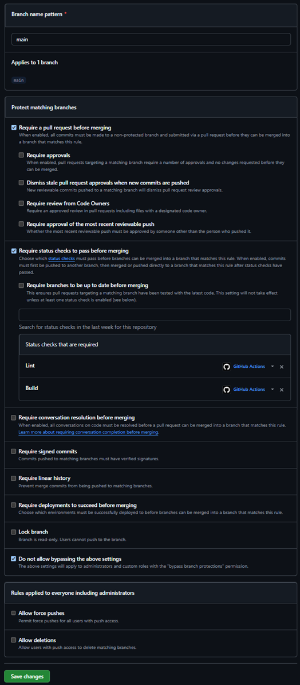

# Projeto individual: Currículo Online - DS881

> Aluna: Sabrina Dorigoni Pelentir

Currículo desenvolvido com [Astro](https://astro.build/), conteinerizado com Docker e publicado automaticamente via GitHub Actions no GitHub Pages.

**Site em produção:** https://sabrina-dp.github.io/ds881-curriculo-GRR20255562/

## Executando localmente com Docker

Pré-requisitos: Docker e Docker Compose instalados.

1. Clone o repositório:
```bash
git clone https://github.com/sabrina-dp/ds881-curriculo-GRR20255562.git
cd ds881-curriculo-GRR20255562
```

2. Suba o ambiente de desenvolvimento:
```bash
docker compose up --build
```

3. Acesse no navegador: http://localhost:8080

Para parar o ambiente:
```bash
docker compose down
```

### Configuração de Branch Protection

